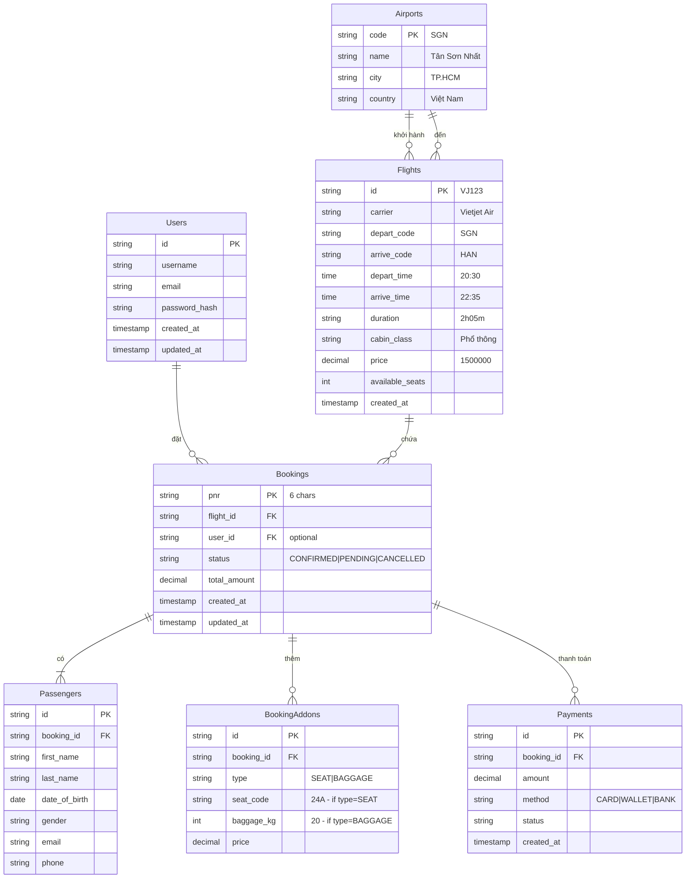

# Sơ đồ ERD - FlightBooker

## Entities & Relationships

## Giải thích quan hệ

1. User (Người dùng)
- Có thể đặt nhiều Booking
- Booking có thể không có User (khách vãng lai)

2. Flight (Chuyến bay)
- Một Flight có nhiều Booking
- Flight có điểm đi/đến là Airports
- Lưu giá vé cơ bản, hạng ghế, số ghế còn

3. Booking (Đặt chỗ)
- Có một Flight
- Có một hoặc nhiều Passenger
- Có các Addon tùy chọn (ghế, hành lý)
- Có các Payment ghi nhận thanh toán
- Có PNR là mã định danh unique
- Có status theo trạng thái xử lý

4. Passenger (Hành khách)
- Thuộc về một Booking
- Lưu thông tin cá nhân để xuất vé

5. BookingAddon (Dịch vụ thêm)
- Thuộc về một Booking
- Có thể là chọn ghế hoặc mua thêm hành lý
- Mỗi loại có thông tin riêng (mã ghế/số kg)
- Có giá tiền riêng

6. Payment (Thanh toán)
- Thuộc về một Booking
- Ghi nhận phương thức và trạng thái
- Có thể có nhiều lần thanh toán

7. Airport (Sân bay)
- Là điểm đi/đến của Flight
- Mã sân bay là unique (3 ký tự)

## Ghi chú
- Giá vé cuối = Flight.price + sum(BookingAddons.price)
- PNR dùng để tra cứu booking
- Có thể thêm bảng cho khuyến mãi, phụ thu, thuế... nếu cần
- Nên có timestamps để audit
- Status nên dùng ENUM trong DB
